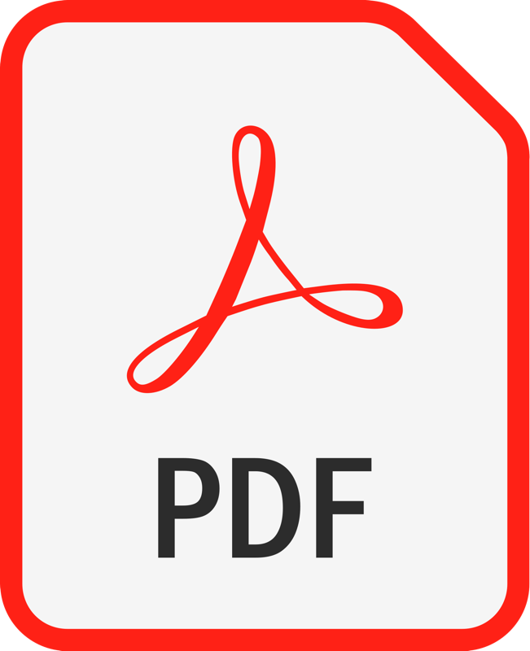

_Say goodbye to secrets and maintaining key rotation mechanisms.
Join me as we explore the power of Azure Managed Identities to improve the security posture for your Logic Apps and Sentinel playbooks.
Learn practical insights about overcoming limitations, integrating Managed Identities as well as real-world examples and tips for integrating these into your Infrastructure-as-Code deployments._

### Download my slidedeck below!

&nbsp;&nbsp;&nbsp;&nbsp;&nbsp;&nbsp;&nbsp;&nbsp;&nbsp;&nbsp;&nbsp;&nbsp;&nbsp;&nbsp;&nbsp;&nbsp;&nbsp;&nbsp;

[**PDF**](https://1drv.ms/b/s!AmKS27jR06WthuouwfNhQyh8aoHh3Q?e=2MynFW)&nbsp;&nbsp;&nbsp;&nbsp;&nbsp;&nbsp;&nbsp;&nbsp;&nbsp;&nbsp;&nbsp;&nbsp;&nbsp;&nbsp;&nbsp;&nbsp;&nbsp;&nbsp;&nbsp;&nbsp;&nbsp;&nbsp;&nbsp;&nbsp;&nbsp;&nbsp;&nbsp;&nbsp;&nbsp;&nbsp;&nbsp;&nbsp;&nbsp;&nbsp;&nbsp;&nbsp;&nbsp;&nbsp;&nbsp;&nbsp;&nbsp;[**PPTx**](https://1drv.ms/p/s!AmKS27jR06WthugDFoTxF65M2e_mKg?e=h385f7)
